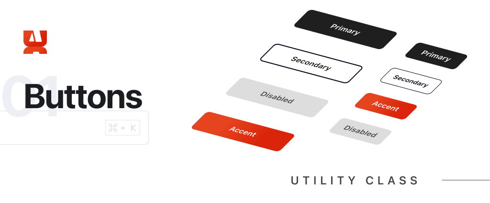
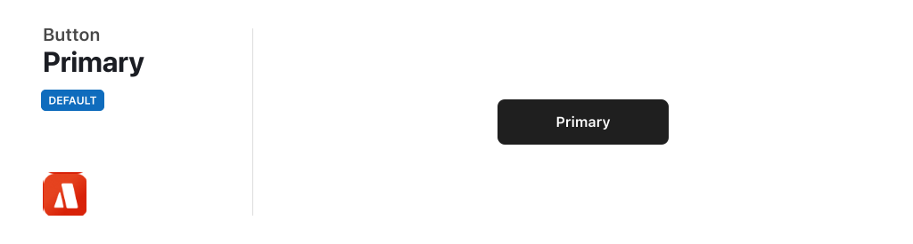
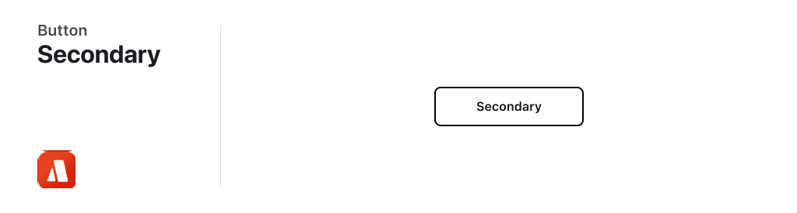
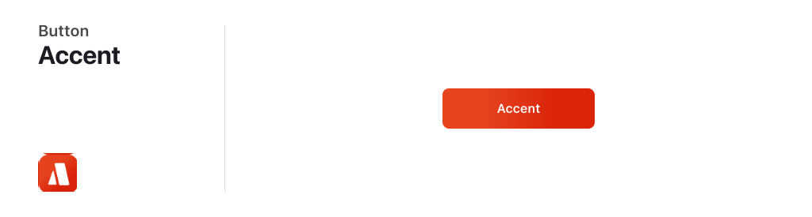
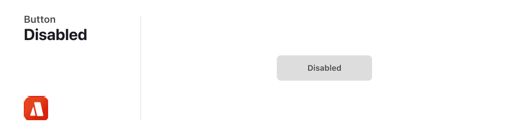
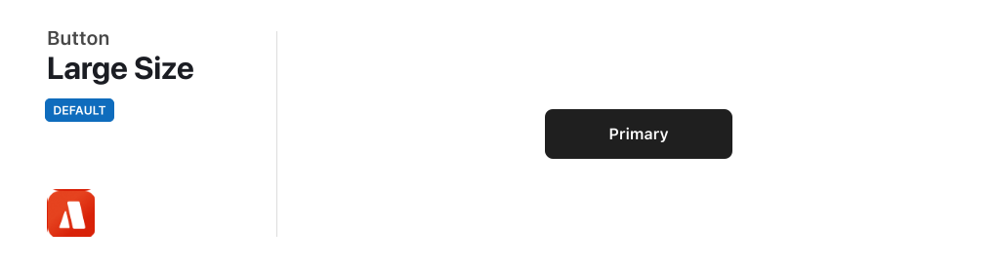
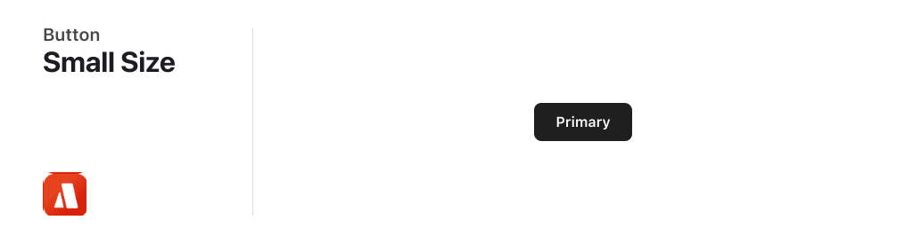
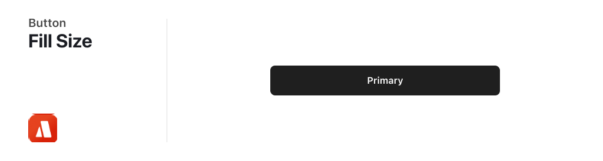

# Buttons



<br/>
<br/>

# Overview

There can be more than one button in a screen, but to create the hierarchy of actions we need to use button kinds.

<br/>
<br/>

# Appearance

### Primary Button

There can be more than one button in a screen, but to create the hierarchy of actions we need to use button kinds.



```html
<button class="btn btn-primary">Primary</button>
```

<br/>

### Secondary Button

There can be more than one button in a screen, but to create the hierarchy of actions we need to use button kinds.



```html
<button class="btn btn-secondary">Secondary</button>
```

<br/>

### Accent Button

There can be more than one button in a screen, but to create the hierarchy of actions we need to use button kinds.



```html
<button class="btn btn-accent">Accent</button>
```

<br/>

### Disabled Button

There can be more than one button in a screen, but to create the hierarchy of actions we need to use button kinds.



```html
<button class="btn btn-disabled">Disabled</button>
```

<br/>

# Size

### Large Button

There can be more than one button in a screen, but to create the hierarchy of actions we need to use button kinds.



```html
<button class="btn btn-primary">Large</button>
```

<br/>

### Small Button

There can be more than one button in a screen, but to create the hierarchy of actions we need to use button kinds.



```html
<button class="btn btn-primary btn-small">Small</button>
```

<br/>

### Fill Button

There can be more than one button in a screen, but to create the hierarchy of actions we need to use button kinds.



```html
<button class="btn btn-primary btn-fill">Fill</button>
```
