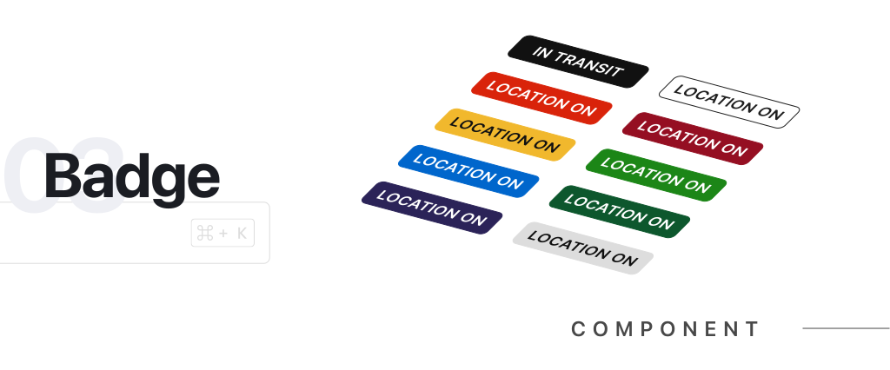
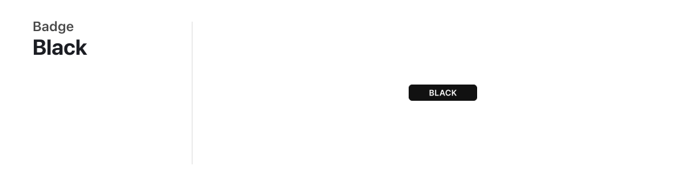
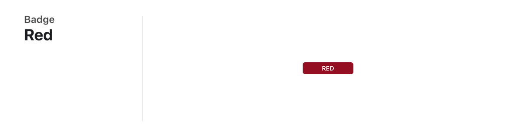
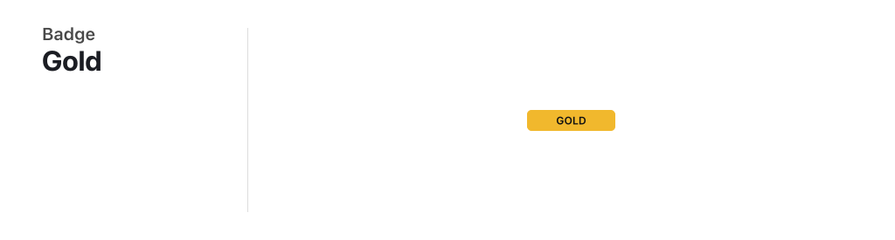
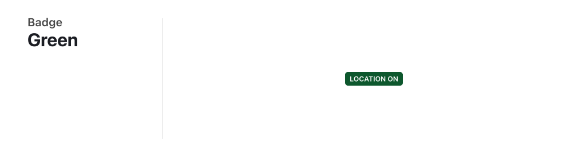
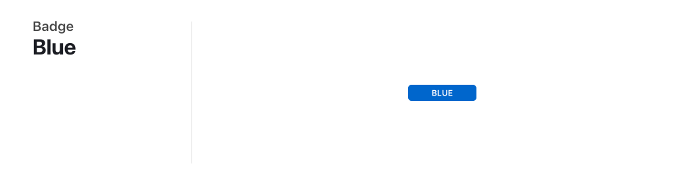
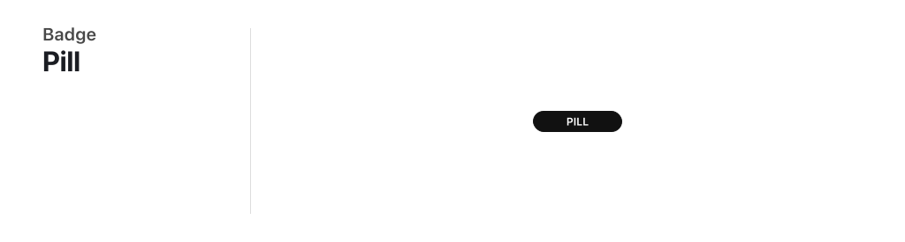

# Badge



<br/>
<br/>

# Table of Contents

-  [Overview](#overview)
-  [Appearance](#appearance)
   -  [White Badge](#white-badge-default)
   -  [Black Badge](#black-badge)
   -  [Red Badge](#red-badge)
   -  [Orange Badge](#orange-badge)
   -  [Gold Badge](#gold-badge)
   -  [Green Badge](#green-badge)
   -  [Blue Badge](#blue-badge)
-  [Roundness / Radius / Shape](#roundness--radius--shape)
   -  [Pill Badge](#pill-badge)
   -  [Icon Badge](#icon-badge)
-  [How to Import Component](#how-to-import-component)
-  [Types & Interfaces](#types--interfaces)

<br/>
<br/>

# Overview

The badge component is a small UI element used to display information or status. It is commonly used to highlight important or relevant information to the user. Badges can be customized with different colors and shapes.

<br/>
<br/>

# Appearance

### White Badge `Default`


```html
<shared-badge> Default </shared-badge>

<!-- OR -->

<shared-badge [color]="'white'"> White </shared-badge>
```

<br/>

### Black Badge



```html
<shared-badge [color]="'black'"> Black </shared-badge>
```

<br/>

### Red Badge



```html
<shared-badge [color]="'red'"> Red </shared-badge>
```

<br/>

### Orange Badge


```html
<shared-badge [color]="'orange'"> Orange </shared-badge>
```

<br/>

### Gold Badge



```html
<shared-badge [color]="'gold'"> Gold </shared-badge>
```

<br/>

### Green Badge



```html
<shared-badge [color]="'gold'"> Green </shared-badge>
```

<br/>

### Blue Badge



```html
<shared-badge [color]="'blue'"> Blue </shared-badge>
```

# Roundness / Radius / Shape

### Pill Badge



```html
<shared-badge [radius]="'radius'"> Pill </shared-badge>
```

### Icon Badge


```html
<shared-badge [radius]="'icon-pill'"> G </shared-badge>
```

<br/>
<br/>
<br/>

# How to Import Component


```typescript
// * Import component from '@atl-transit/shared' library
import { BadgeComponent } from '@atl-transit/shared';

@Component({
   selector: 'my-component',
   standalone: true,
   // * Add component to your imports here
   imports: [BadgeComponent],
   template: ` <shared-badge> Default </shared-badge> `
})
export class MyComponent {}
```

<br/>
<br/>
<br/>

# Types & Interfaces


### Badge Color Type

```typescript
export type BadgeColor = 'gold' | 'red' | 'orange' | 'green' | 'blue' | 'gray' | 'white' | 'black';
```

### Badge Radius / Roundness Type

```typescript
export type BadgeRadius = 'default' | 'pill' | 'icon';
```
