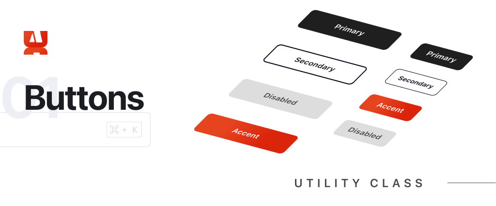
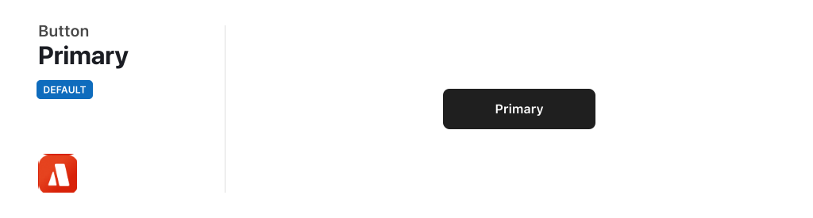
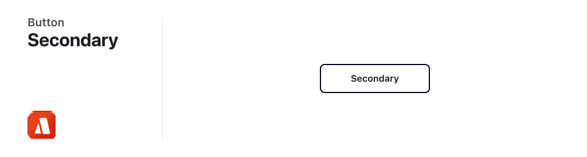
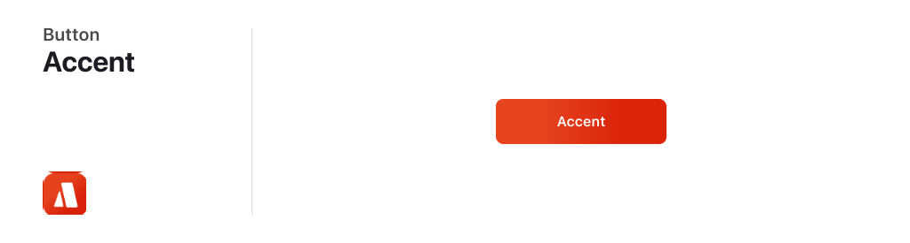
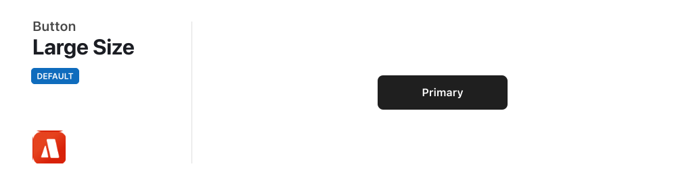
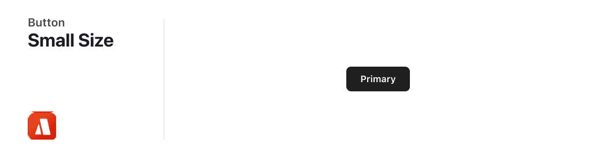
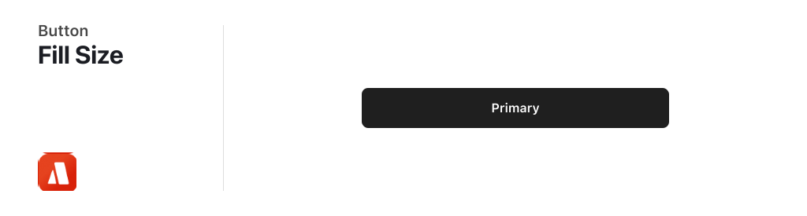
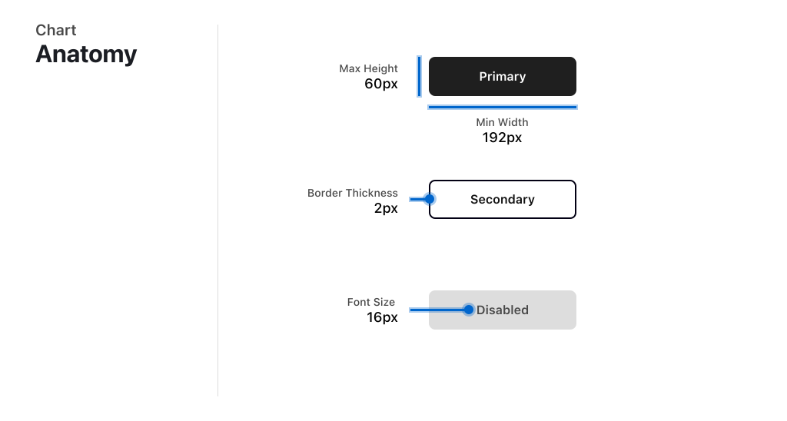

# Buttons



<br/>
<br/>

# Table of Contents

1. [Overview](#overview)
2. [Appearance](#appearance)
    - [Primary Button](#primary-button)
    - [Secondary Button](#secondary-button)
    - [Accent Button](#accent-button)
    - [Disabled Button](#disabled-button)
3. [Size](#size)
    - [Large Button](#large-button)
    - [Small Button](#small-button)
    - [Fill Button](#fill-button)
4. [Anatomy Chart](#anatomy-chart)


<br/>
<br/>


# Overview

With a vast selection of over 7.7 million listings, our aim is to simplify the process for guests to discover the perfect accommodation that suits their preferences. In our Winter Release of 2023, we unveiled 'Guest Favorites', a curated collection of two million highly esteemed homes. These listings have been selected based on their outstanding ratings, reviews, and reliability data gathered from more than half a billion trips. Please note that this information serves as placeholder text.

<br/>
<br/>

# Appearance

### Primary Button

With a vast selection of over 7.7 million listings, our aim is to simplify the process for guests to discover the perfect accommodation that suits their preferences. In our Winter Release of 2023, we unveiled 'Guest Favorites', a curated collection of two million highly esteemed homes. These listings have been selected based on their outstanding ratings, reviews, and reliability data gathered from more than half a billion trips. Please note that this information serves as placeholder text.



```html
<button class="btn btn-primary">Primary</button>
```

<br/>

### Secondary Button

With a vast selection of over 7.7 million listings, our aim is to simplify the process for guests to discover the perfect accommodation that suits their preferences. In our Winter Release of 2023, we unveiled 'Guest Favorites', a curated collection of two million highly esteemed homes. These listings have been selected based on their outstanding ratings, reviews, and reliability data gathered from more than half a billion trips. Please note that this information serves as placeholder text.



```html
<button class="btn btn-secondary">Secondary</button>
```

<br/>

### Accent Button

With a vast selection of over 7.7 million listings, our aim is to simplify the process for guests to discover the perfect accommodation that suits their preferences. In our Winter Release of 2023, we unveiled 'Guest Favorites', a curated collection of two million highly esteemed homes. These listings have been selected based on their outstanding ratings, reviews, and reliability data gathered from more than half a billion trips. Please note that this information serves as placeholder text.



```html
<button class="btn btn-accent">Accent</button>
```

<br/>

### Disabled Button

With a vast selection of over 7.7 million listings, our aim is to simplify the process for guests to discover the perfect accommodation that suits their preferences. In our Winter Release of 2023, we unveiled 'Guest Favorites', a curated collection of two million highly esteemed homes. These listings have been selected based on their outstanding ratings, reviews, and reliability data gathered from more than half a billion trips. Please note that this information serves as placeholder text.


```html
<button class="btn btn-disabled">Disabled</button>
```

<br/>

# Size

### Large Button

With a vast selection of over 7.7 million listings, our aim is to simplify the process for guests to discover the perfect accommodation that suits their preferences. In our Winter Release of 2023, we unveiled 'Guest Favorites', a curated collection of two million highly esteemed homes. These listings have been selected based on their outstanding ratings, reviews, and reliability data gathered from more than half a billion trips. Please note that this information serves as placeholder text.



```html
<button class="btn btn-primary">Large</button>
```

<br/>

### Small Button

With a vast selection of over 7.7 million listings, our aim is to simplify the process for guests to discover the perfect accommodation that suits their preferences. In our Winter Release of 2023, we unveiled 'Guest Favorites', a curated collection of two million highly esteemed homes. These listings have been selected based on their outstanding ratings, reviews, and reliability data gathered from more than half a billion trips. Please note that this information serves as placeholder text.



```html
<button class="btn btn-primary btn-small">Small</button>
```

<br/>

### Fill Button

With a vast selection of over 7.7 million listings, our aim is to simplify the process for guests to discover the perfect accommodation that suits their preferences. In our Winter Release of 2023, we unveiled 'Guest Favorites', a curated collection of two million highly esteemed homes. These listings have been selected based on their outstanding ratings, reviews, and reliability data gathered from more than half a billion trips. Please note that this information serves as placeholder text.



```html
<button class="btn btn-primary btn-fill">Fill</button>
```

<br/>
<br/>

# Anatomy Chart


